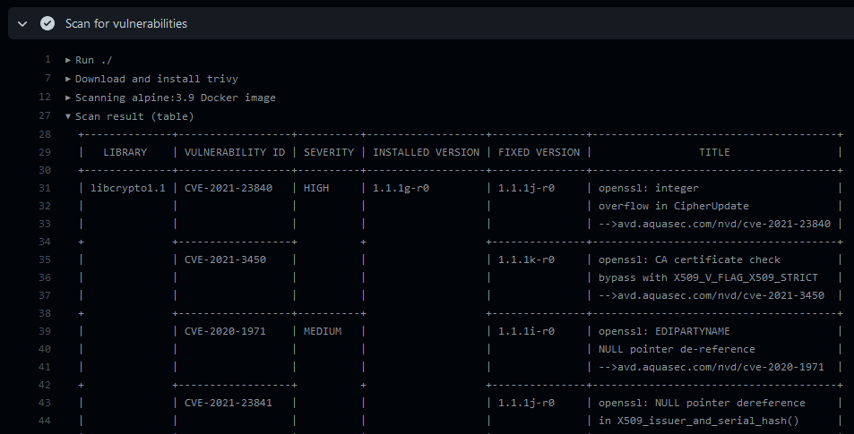
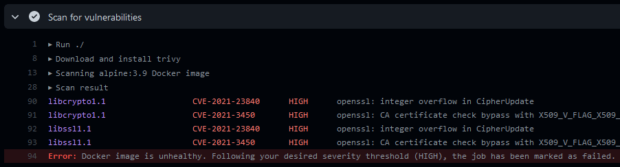
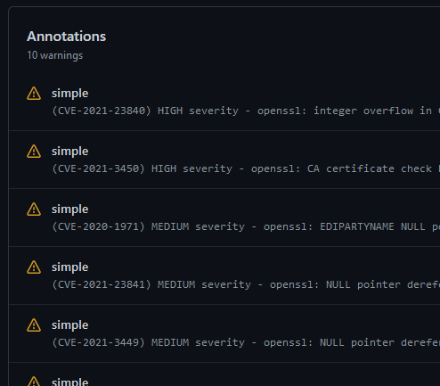
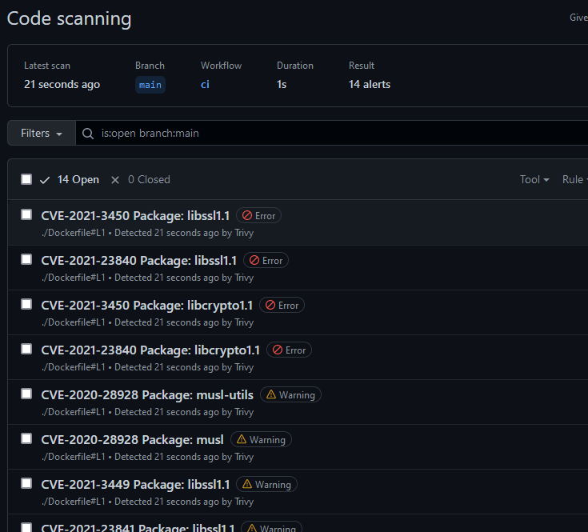

[](https://github.com/crazy-max/ghaction-container-scan/releases/latest)
[](https://github.com/marketplace/actions/container-scan)
[](https://github.com/crazy-max/ghaction-container-scan/actions?workflow=test)
[](https://codecov.io/gh/crazy-max/ghaction-container-scan)
[](https://github.com/sponsors/crazy-max)
[](https://www.paypal.me/crazyws)

## About

GitHub Action to check for vulnerabilities in your container image with
[Trivy](https://github.com/aquasecurity/trivy).



___

* [Usage](#usage)
  * [Scan image](#scan-image)
  * [Scan tarball](#scan-tarball)
  * [Severity threshold](#severity-threshold)
  * [Ignore Unfixed Vulnerabilities](#ignore-unfixed-vulnerabilities)
  * [GitHub annotations](#github-annotations)
  * [Upload to GitHub Code Scanning](#upload-to-github-code-scanning)
  * [Build, scan and push your image](#build-scan-and-push-your-image)
* [Customizing](#customizing)
  * [inputs](#inputs)
  * [outputs](#outputs)
* [Notes](#notes)
  * [`GITHUB_TOKEN` Minimum Permissions](#github_token-minimum-permissions)
  * [`Advanced Security must be enabled for this repository to use code scanning`](#advanced-security-must-be-enabled-for-this-repository-to-use-code-scanning)  
  * [`failed to copy the image: write /tmp/fanal-2740541230: no space left on device`](#failed-to-copy-the-image-write-tmpfanal-2740541230-no-space-left-on-device)
  * [`timeout: context deadline exceeded`](#timeout-context-deadline-exceeded)
  * [`could not parse reference: ghcr.io/UserName/myimage:latest`](#could-not-parse-reference-ghcriousernamemyimagelatest)
* [Contributing](#contributing)
* [License](#license)

## Usage

### Scan image

```yaml
name: ci

on:
  push:

jobs:
  scan:
    runs-on: ubuntu-latest
    steps:
      -
        name: Checkout
        uses: actions/checkout@v3
      -
        name: Build
        uses: docker/build-push-action@v4
        with:
          context: .
          push: true
          tags: user/app:latest
      -
        name: Scan for vulnerabilities
        uses: crazy-max/ghaction-container-scan@v3
        with:
          image: user/app:latest
```

### Scan tarball

```yaml
name: ci

on:
  push:

jobs:
  scan:
    runs-on: ubuntu-latest
    steps:
      -
        name: Checkout
        uses: actions/checkout@v3
      -
        name: Set up Docker Buildx
        uses: docker/setup-buildx-action@v2
      -
        name: Build
        uses: docker/build-push-action@v4
        with:
          context: .
          outputs: type=docker,dest=/tmp/image.tar
          tags: user/app:latest
      -
        name: Scan for vulnerabilities
        uses: crazy-max/ghaction-container-scan@v3
        with:
          tarball: /tmp/image.tar
```

### Severity threshold

You can define a threshold for severity to mark the job as failed:

```yaml
name: ci

on:
  push:

jobs:
  scan:
    runs-on: ubuntu-latest
    steps:
      -
        name: Checkout
        uses: actions/checkout@v3
      -
        name: Build
        uses: docker/build-push-action@v4
        with:
          context: .
          push: true
          tags: user/app:latest
      -
        name: Scan for vulnerabilities
        uses: crazy-max/ghaction-container-scan@v3
        with:
          image: user/app:latest
          severity_threshold: HIGH
```

### Ignore Unfixed Vulnerabilities

By default, Trivy also detects unpatched/unfixed vulnerabilities. This means you can't fix these vulnerabilities even if you update all packages. If you would like to ignore them:

```yaml
name: ci

on:
  push:

jobs:
  scan:
    runs-on: ubuntu-latest
    steps:
      -
        name: Checkout
        uses: actions/checkout@v3
      -
        name: Build
        uses: docker/build-push-action@v4
        with:
          context: .
          push: true
          tags: user/app:latest
      -
        name: Scan for vulnerabilities
        uses: crazy-max/ghaction-container-scan@v3
        with:
          image: user/app:latest
          ignore_unfixed: true
```



### GitHub annotations

This action is also able to create GitHub annotations in your workflow for
vulnerabilities discovered:

```yaml
name: ci

on:
  push:

jobs:
  scan:
    runs-on: ubuntu-latest
    steps:
      -
        name: Checkout
        uses: actions/checkout@v3
      -
        name: Build
        uses: docker/build-push-action@v4
        with:
          context: .
          push: true
          tags: user/app:latest
      -
        name: Scan for vulnerabilities
        uses: crazy-max/ghaction-container-scan@v3
        with:
          image: user/app:latest
          annotations: true
```



### Upload to GitHub Code Scanning

This action also supports the [SARIF format](https://docs.github.com/en/code-security/code-scanning/integrating-with-code-scanning/uploading-a-sarif-file-to-github)
for integration with [GitHub Code Scanning](https://docs.github.com/en/github/finding-security-vulnerabilities-and-errors-in-your-code/about-code-scanning)
to show issues in the [GitHub Security](https://docs.github.com/en/repositories/managing-your-repositorys-settings-and-features/enabling-features-for-your-repository/managing-security-and-analysis-settings-for-your-repository)
tab:

```yaml
name: ci

on:
  push:

jobs:
  scan:
    runs-on: ubuntu-latest
    steps:
      -
        name: Checkout
        uses: actions/checkout@v3
      -
        name: Build
        uses: docker/build-push-action@v4
        with:
          context: .
          push: true
          tags: user/app:latest
      -
        name: Scan for vulnerabilities
        id: scan
        uses: crazy-max/ghaction-container-scan@v3
        with:
          image: user/app:latest
          dockerfile: ./Dockerfile
      -
        name: Upload SARIF file
        if: ${{ steps.scan.outputs.sarif != '' }}
        uses: github/codeql-action/upload-sarif@v2
        with:
          sarif_file: ${{ steps.scan.outputs.sarif }}
```

> :bulb: `dockerfile` input is required to generate a sarif report.



### Build, scan and push your image

```yaml
name: ci

on:
  push:

jobs:
  scan:
    runs-on: ubuntu-latest
    steps:
      -
        name: Checkout
        uses: actions/checkout@v3
      -
        name: Set up QEMU
        uses: docker/setup-qemu-action@v2
      -
        name: Set up Docker Buildx
        uses: docker/setup-buildx-action@v2
      -
        name: Build and load
        uses: docker/build-push-action@v4
        with:
          context: .
          load: true
          tags: user/app:latest
      -
        name: Scan for vulnerabilities
        id: scan
        uses: crazy-max/ghaction-container-scan@v3
        with:
          image: user/app:latest
          dockerfile: ./Dockerfile
      -
        name: Build multi-platform and push
        uses: docker/build-push-action@v4
        with:
          context: .
          platforms: linux/amd64,linux/arm64
          push: true
          tags: user/app:latest
```

## Customizing

### inputs

Following inputs can be used as `step.with` keys

| Name                 | Type   | Description                                                                                      |
|----------------------|--------|--------------------------------------------------------------------------------------------------|
| `trivy_version`      | String | [Trivy CLI](https://github.com/aquasecurity/trivy) version (default `latest`)                    |
| `image`              | String | Container image to scan (e.g. `alpine:3.7`)                                                      |
| `tarball`            | String | Container image tarball path to scan                                                             |
| `dockerfile`         | String | Dockerfile required to generate a sarif report                                                   |
| `severity`           | String | Report vulnerabilities of provided level or higher (default: `UNKNOWN,LOW,MEDIUM,HIGH,CRITICAL`) |
| `severity_threshold` | String | Defines threshold for severity                                                                   |
| `annotations`        | Bool   | Create GitHub annotations in your workflow for vulnerabilities discovered                        |

### outputs

Following outputs are available

| Name    | Type | Description              |
|---------|------|--------------------------|
| `json`  | File | JSON format scan result  |
| `sarif` | File | SARIF format scan result |

## Notes

### GITHUB_TOKEN Minimum Permissions

If you want the scan to include the Dockerfile, you'll need to checkout the repository and give the job:

```yaml
permissions:
  contents: read
```

If you want to upload the SARIF report to GitHub Security, you'll need to add these permissions to the job:

```yaml
permissions:
  actions: read
  security-events: write
```

### `Advanced Security must be enabled for this repository to use code scanning`

If you receive this error, it likely means you're using a private repository and trying to upload SARIF reports, which requires a org admin to enable Advanced Security for the repository.

### `failed to copy the image: write /tmp/fanal-2740541230: no space left on device`

If you encounter this error, you probably have a huge image to scan so, you may
need to free up some space in your runner. You can remove the dotnet framework
for example that takes around 23GB of disk space:

```yaml
      -
        name: Remove dotnet
        run: sudo rm -rf /usr/share/dotnet
      -
        name: Scan for vulnerabilities
        uses: crazy-max/ghaction-container-scan@v3
        with:
          image: user/app:latest
```

### `timeout: context deadline exceeded`

This error is caused by the timeout of the `trivy` command. You can increase
the timeout by setting `TRIVY_TIMEOUT` environment variable:

```yaml
      -
        name: Scan for vulnerabilities
        uses: crazy-max/ghaction-container-scan@v3
        with:
          image: user/app:latest
        env:
          TRIVY_TIMEOUT: 10m
```

### `could not parse reference: ghcr.io/UserName/myimage:latest`

You may encounter this issue if you're using `github.repository` as a
repo slug for the image input:

```
Error: 2021-11-30T09:52:13.115Z	FATAL	scan error: unable to initialize a scanner: unable to initialize a docker scanner: failed to parse the image name: could not parse reference: ghcr.io/UserName/myimage:latest
```

To fix this issue you can use our [metadata action](https://github.com/docker/metadata-action)
to generate sanitized tags:

```yaml
-
  name: Docker meta
  id: meta
  uses: docker/metadata-action@v4
  with:
    images: ghcr.io/${{ github.repository }}
    tags: latest
-
  name: Build and push
  uses: docker/build-push-action@v4
  with:
    context: .
    push: true
    tags: ${{ steps.meta.outputs.tags }}
-
  name: Scan for vulnerabilities
  id: scan
  uses: crazy-max/ghaction-container-scan@v3
  with:
    image: ${{ fromJSON(steps.meta.outputs.json).tags[0] }}
    dockerfile: ./Dockerfile
```

Or a dedicated step to sanitize the slug:

```yaml
-
  name: Sanitize repo slug
  uses: actions/github-script@v6
  id: repo_slug
  with:
    result-encoding: string
    script: return 'ghcr.io/${{ github.repository }}'.toLowerCase()
-
  name: Build and push
  uses: docker/build-push-action@v4
  with:
    context: .
    push: true
    tags: ${{ steps.repo_slug.outputs.result }}:latest
-
  name: Scan for vulnerabilities
  id: scan
  uses: crazy-max/ghaction-container-scan@v3
  with:
    image: ${{ steps.repo_slug.outputs.result }}:latest
    dockerfile: ./Dockerfile
```

## Contributing

Want to contribute? Awesome! The most basic way to show your support is to star
the project, or to raise issues. You can also support this project by [**becoming a sponsor on GitHub**](https://github.com/sponsors/crazy-max)
or by making a [PayPal donation](https://www.paypal.me/crazyws) to ensure this
journey continues indefinitely!

Thanks again for your support, it is much appreciated! :pray:

## License

MIT. See `LICENSE` for more details.
